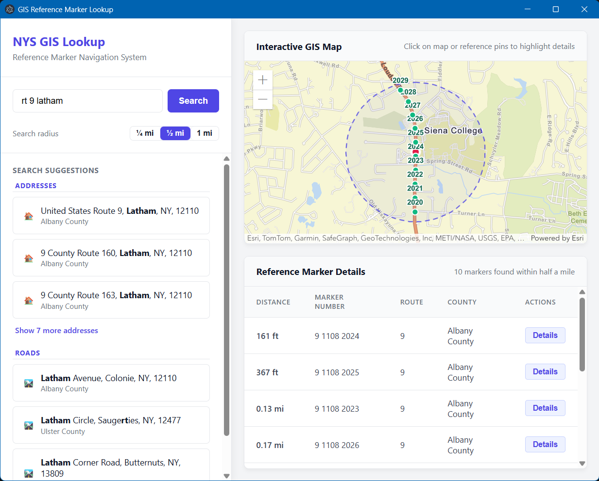

# NYS GIS Reference Marker Lookup Tool

This tool provides a user-friendly interface for querying NYSDOT reference markers based on locations. It is a desktop dashboard built with an **Electron** frontend and a Python **FastAPI** backend.

---



---

## Architecture
A decoupled, web-native desktop app. A Python FastAPI backend handles the GIS lookups, and an Electron frontend hosts a fully interactive **ArcGIS Map** side-by-side with your attribute details.

---

## Features
- **Interactive ArcGIS Map:** Embedded, fully interactive vector map pane displaying search targets and results.
- **Half-Mile Search Radius:** Searching an address or clicking the map shows every reference marker within 0.5 miles of that spot.
- **Bi-Directional Highlight & Sync:**
  - Clicking any reference marker pin (Emerald Green) on the map instantly highlights and **smoothly scrolls to its matching row** in the details table.
  - Clicking any row in the details table automatically **pans and focuses the map** on that specific marker pin.
- **Auto-Zoom to Fit:** The map automatically calculates bounds and adjusts zoom levels so that your search target and all surrounding reference markers are perfectly framed.
- **Deep Metadata Modal:** Click "Details" on any row to open a blurred overlay modal showing the complete list of attribute fields for that reference marker.
- **Graceful Clean Shutdown:** Closing the window shuts down the app's background lookup service too, and it also stops on its own if the app ever crashes, so nothing is left running in the background.

---

## Installing the App

1. Go to the repository's **Releases** page on GitHub and open the latest release.
2. Download the installer for your computer:
   - **Windows:** the `.exe` file. Run it and follow the prompts.
   - **macOS:** the `.dmg` file. Open it and drag **NYS GIS Lookup** into Applications.
   - **Linux:** the `.AppImage` (make it executable, then run it) or the `.deb` (install with `sudo apt install ./<file>.deb`).
3. Launch **NYS GIS Lookup**. It may take a few seconds to open while its lookup service starts in the background.

An internet connection is required, because the app looks up addresses and reference markers from New York State's online GIS services.

**macOS note:** the app isn't signed with an Apple developer certificate yet, so macOS may block it the first time. Right-click the app in Applications, choose **Open**, then confirm **Open**.

### Troubleshooting

- **"NYS GIS Lookup could not start":** the background lookup service failed to start. The message shows the location of `backend.log`, which records what went wrong. The most common cause is another program already using port 8000; close it and try again.
- **"...is taking too long to respond":** a New York State GIS service is slow or overloaded. The app already retried once for you; wait a moment and search again.
- **"Could not reach the...":** the app couldn't connect to a New York State GIS service. Check your internet connection (and any VPN or firewall), then try again.
- **"...reported a problem":** the state service answered with an error. Try again; if it keeps happening, the service may be down for maintenance.
- **"Part of the search timed out, so some markers may be missing":** most of the marker search worked, but part of it was too slow. The markers shown are correct; search again to make sure none are missing.
- **Log file locations:**
  - Windows: `%APPDATA%\nys-gis-frontend\logs\backend.log`
  - macOS: `~/Library/Logs/nys-gis-frontend/backend.log`
  - Linux: `~/.config/nys-gis-frontend/logs/backend.log`

---

## Using the App

The app shows the NYSDOT reference markers near any location in New York State: within **half a mile** by default. There are several ways to pick a location, described below.

### Choosing the search radius
Use the **Search radius** switch under the search box to search within **¼ mile**, **½ mile** or **1 mile**. Changing it re-searches the current location straight away, so you can widen or narrow a search without searching again. If no markers are found, the results area says so and offers a one-click wider search (for example **Search within half a mile**).

### Search by address or place
1. Start typing an address, road, intersection, city or county into the search box, for example `5700 Route 44 55, Kerhonkson, NY`. Suggestions appear as soon as you pause (after at least three characters); you can also press **Enter** or click **Search** to look right away.
2. Pick the matching entry in the **Search Suggestions** list by clicking it, or with the keyboard:
   - **↓ / ↑** move through the suggestions (including the **Show more** links)
   - **Enter** picks the highlighted suggestion (with nothing highlighted, it searches immediately)
   - **Esc** clears the highlight
3. Suggestions are grouped by kind of place, each with its own icon, from most to least specific:
   - 🏠 **Addresses**
   - 🚦 **Intersections**
   - 🛣️ **Roads**
   - 🏘️ **Towns & Cities**
   - 🗺️ **Counties**

   Each group shows its three best matches first; click **Show more** under a group to see the rest. A place is only listed once, in its most specific group. The words you typed are shown in **bold**, and a moment after the list appears each suggestion gains a second line with its town and county (for example *Ulster County*), so similar-sounding places are easy to tell apart.

### Search by reference marker number
If you know a marker's number (from its green panel at the roadside, or from the results table), type it into the search box. The number is the route followed by the two lines of digits on the panel, for example **`44 8601 1035`**:

| Part | Example | Meaning |
| --- | --- | --- |
| Route | `44` | the route the marker is on (may include letters, e.g. `9W`) |
| First line | `8601` | region and county (`86` = Region 8, Ulster County) and control section (`01`) |
| Second line | `1035` | the marker's sequence number along the route |

Spacing doesn't matter: `44 8601 1035`, `44 86011035` and `4486011035` all work.

- As you type (from the route plus four digits, e.g. `44 8601`), the list shows the matching **Reference Markers** in order, up to ten at a time; keep typing to narrow it down.
- Pick a marker (click, or **↓** and **Enter**) to jump to it: its pin gets a red ring, the markers around it are shown, and its row is highlighted in the table.
- Typing a complete number and pressing **Enter** goes straight to that marker.

If nothing matches a number-like search, the app looks it up as an address instead.

### Search by coordinates
Type two numbers into the same search box and press **Enter**; the markers appear right away. While you're still typing, the list shows how your coordinates will be read, and no search runs until you press **Enter** or click that entry. These formats are recognized:

| Format | Example |
| --- | --- |
| Latitude, longitude (decimal degrees) | `41.7, -74.3` |
| Longitude, latitude | `-74.3, 41.7` |
| UTM zone 18N easting, northing (meters) | `560638, 4621699` |
| UTM zone 18N northing, easting | `4621699, 560638` |

The numbers can be separated by a comma, a semicolon or spaces, and degree signs (`°`) are fine. The app works out which number is which from New York's location, and shows how it read your input under **Coordinates** in the sidebar, so you can confirm it. A longitude typed without its minus sign (`41.7, 74.3`) is read as west longitude, since all of New York is west of Greenwich. Coordinates outside New York are rejected with a message explaining what to enter.

### Click the map
Click anywhere on the map to see the markers around that spot.

### Reading the results
- The **Reference Marker Details** table shows each marker's essentials:

  | Column | Example | Meaning |
  | --- | --- | --- |
  | Distance | *307 ft* | how far the marker is from your search location |
  | Marker Number | *44 8601 1035* | the number on the marker's panel (route, then its two lines of digits) |
  | Route | *44* | the route the marker is on |
  | County | *Ulster County* | the county, decoded from the marker's NYSDOT region/county code |

- Click **Details** on a row for everything about that marker: the summary above plus its NYSDOT region, followed by every field exactly as the NYSDOT service provides it.
- The table lists markers **closest first**. The **Distance** column shows the ground distance from your search location: feet under a tenth of a mile (e.g. *420 ft*), miles beyond (e.g. *0.32 mi*). When you search for a marker by number, distances are measured from that marker, so it appears first at *0 ft*.
- The **red pin** marks your search location (**purple** when you clicked the map), and **green pins** are the reference markers found.
- The results count above the table says how many markers were found and within what distance (e.g. *10 markers found within 1 mile*).
- The **dashed circle** shows the area searched: everything within the chosen radius of your search location.
- Each green pin is labeled with the **last line of its marker number** (e.g. *1035*), the part that differs between neighboring markers on a route. When the results include more than one route, the label adds the route (e.g. *44 · 1035*). Click a pin to see its full number and county.
- Clicking a green pin highlights its row in the **Reference Marker Details** table; clicking a row moves the map to its pin.

---

## Running from Source (Developers)

### Prerequisites
- **Python 3.12+**
- **Node.js & npm** (LTS recommended)

### 1. Setup the Backend
From the root project directory, install the FastAPI backend dependencies:
```bash
python -m pip install fastapi uvicorn requests pydantic
```

### 2. Setup the Frontend
Navigate into the `gis-frontend` directory and install the Node/Electron dependencies:
```bash
cd gis-frontend
npm install
```

### 3. Run the Application
From inside the `gis-frontend` folder:
```bash
npm run dev
```
The app finds a Python interpreter that has the backend packages installed (it tries `python`, `py` and `python3` on Windows, and `python3` then `python` elsewhere), starts the backend with it, and opens the window once the backend is ready. Backend log messages appear in the same terminal, and the backend shuts down when you close the window. The `uvicorn` command does not need to be on your PATH.

If you have more than one Python installed, point the app at the right one with the `GIS_PYTHON` environment variable:
```bash
# Windows (PowerShell)
$env:GIS_PYTHON = "C:\path\to\python.exe"; npm run dev

# macOS / Linux
GIS_PYTHON=/path/to/python npm run dev
```

You can also run the backend yourself with `python main.py` from the root directory; `npm run dev` detects it and uses it instead of starting its own. A backend you started yourself keeps running when you close the window; stop it with **Ctrl+C**.

The backend has no shutdown endpoint. The app starts it with `--stop-on-stdin-close` and stops it by closing its standard input, a pipe only the app holds, so no web page or other program can shut it down. If the app crashes, the operating system closes the pipe and the backend exits on its own.

---

## Under-the-Hood GIS Pipeline Flow
The backend pipes queries through the core orchestrator engine in `gis_pipeline.py` using one of two workflows:

1.  **Address Flow:** 
    - Input (Address) -> Suggest (Geocoder) -> Geocode (Geocoder) -> Find Nearby Markers (MapServer query).
2.  **Coordinate Flow:** 
    - Input (Coordinates) -> Parse & Validate (`CoordinateParser`) -> Find Nearby Markers (MapServer query).

The search box calls the backend's `/search` endpoint, which returns either parsed coordinates or address suggestions, so both kinds of input share one box. For UTM input, the backend also converts the point to latitude/longitude (`utm_projection.py`) so the map can draw the search pin without loading ArcGIS's projection engine; the marker search itself uses the original UTM values.

Each marker's distance from the search location is calculated in the backend (`geodesy.py`): both points are converted to latitude/longitude, whatever spatial reference they arrived in, and measured on the WGS 84 ellipsoid (accurate to a fraction of an inch at these distances). Results are returned sorted closest first.

Markers are found with a distance query: the NYSDOT service buffers the location by a true 0.5-mile radius in its own UTM 18N (meter) coordinate system, so the search area is an accurate circle whether the location arrives as lat/lon, UTM or Web Mercator. The service draws the same markers in nine scale-dependent sub-layers; all are queried in parallel and duplicates are removed by `OBJECTID`.

### Native API Endpoints Queried:
- **Geocoder Suggestions:** `https://nysgeohub.ny.gov/arcgis/rest/services/Geocoder/NYS_Geocoder/GeocodeServer/suggest`
- **Geocoder Candidates:** `https://nysgeohub.ny.gov/arcgis/rest/services/Geocoder/NYS_Geocoder/GeocodeServer/findAddressCandidates`
- **Reference Marker Query:** `https://gis.dot.ny.gov/hostingny/rest/services/Ref_Marker/MapServer/<layer 1-9>/query`

### Running the Tests
From the root project directory:
```bash
pip install httpx
python -m unittest discover -s tests -t . -v
```

To check a compiled backend's startup and shutdown (the release build does this on every platform):
```bash
python scripts/smoke_test_backend.py dist/gis-backend/gis-backend
```
